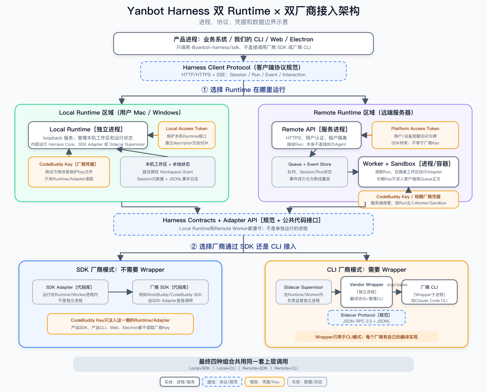

# Yanbot Harness 总体运行架构

本文是 Yanbot Harness 关于安装分发、Runtime 部署、Adapter 装载、进程边界、协议和凭据流向的架构基准。总体 Spec、
双 Runtime Spec、CLI Harness Adapter Spec、README 和交付兼容矩阵必须与本文保持一致；各子 Spec 只细化实现，
不得重新定义这些边界。



可编辑矢量版本：[yanbot-harness-runtime-adapter-architecture.svg](./assets/yanbot-harness-runtime-adapter-architecture.svg)。

## 0. 安装入口与运行边界

**以下安装拓扑已实现为 preview.3 测试签名候选，未生产发布，认证未全部完成。** `0.1.0-preview.2` 仍交付公共 tgz 和独立
Runtime archive，managed 启动仍需显式路径或环境变量。安装图不改变当前兼容声明。

| 用户场景                         | 推荐安装入口                                  | 安装后的运行方式                                                               |
| -------------------------------- | --------------------------------------------- | ------------------------------------------------------------------------------ |
| 普通本地 Node 集成               | `@yanbot-harness/local`                       | facade 复用 SDK，自动定位已安装平台 payload，SDK 拉起独立 Local Runtime 子进程 |
| Remote / 显式 Daemon 客户端      | `@yanbot-harness/sdk`                         | 轻量公共客户端，无 Runtime 生产/optional 依赖；连接显式目标                    |
| 独立 Daemon、Electron 与高级部署 | `@yanbot-harness/runtime` 或 portable archive | 独立安装/宿主携带 Runtime，显式连接或托管，宿主承担生命周期                    |

local 依赖同版 sdk 和 runtime meta；meta 通过精确版本 optionalDependencies 引入 `runtime-<os>-<cpu>`。
平台包以 `os/cpu` 选择目标，携带完整 Runtime payload。第一次显式启动时本机校验/展开至用户缓存，随后
通过 HTTP/SSE 调用独立进程。安装、import 和 Remote 连接不启动 Runtime，启动过程不联网下载。

“一次安装”是消费者入口的简化，SDK、Runtime、Adapter 仍是不同模块；meta/resolver 是宿主内的少量安装管理代码，
不是新的服务进程。SDK 本身保持轻量，自动发现由 local 的 resolver 装配完成；跨平台包缺失必须可诊断。
初始目标为 Mac arm64、Windows x64，Linux x64 glibc 保留 Reference 回归；Intel Mac/Windows arm64 不自动获得认证。

完整方案及已确认取舍见 [`unified-local-distribution`](../specs/unified-local-distribution/design.md)。Electron
保留独立资源路径，但普通 Node 的 `process.execPath` 启动方式不能直接作为 Electron 认证证据。

## 1. 两个相互独立的选择维度

系统有两个正交维度，不能混为一层：

1. **Runtime 部署位置**：Local Runtime 或 Remote Runtime。
2. **厂商接入方式**：厂商 SDK 型 Adapter 或厂商 CLI 型 Sidecar Adapter。

本文中的 Remote Runtime 是完整远端执行面：`Remote API/Control Plane + Queue/Event Store + Remote Worker/Sandbox`，
不是单指 Remote API 服务。

因此目标架构支持四种组合：

| Runtime | SDK 型厂商                                      | CLI 型厂商                                   |
| ------- | ----------------------------------------------- | -------------------------------------------- |
| Local   | SDK Adapter 在 Local Runtime 进程内调用厂商 SDK | Sidecar Wrapper 在本机托管厂商 CLI           |
| Remote  | SDK Adapter 在 Worker/沙箱内调用厂商 SDK        | Sidecar Wrapper 在 Worker/沙箱内托管厂商 CLI |

四种组合共享 `@yanbot-harness/sdk` 实现（本地可经 `@yanbot-harness/local` 安装入口）、平台 CLI、Session、Run、Event、Interaction、错误分类和 capability 语义。
上层业务不能根据厂商名或 Runtime 位置分叉核心调用。

## 2. 进程与非进程边界

### 独立进程或服务

- 业务系统、平台 CLI、Web/Electron 宿主是客户端进程。
- Local Runtime 是只监听 loopback 的独立服务进程。
- Remote API 是负责 HTTPS、认证、租户、Run 接收和事件出口的服务进程，本身不执行 Agent。
- Remote Worker 是领取队列任务的执行进程；Sandbox 是每个 Run 的隔离容器或等价执行环境。
- CLI 型 Adapter 的 Vendor Wrapper 是独立 Sidecar 进程。
- 厂商 CLI 是由 Vendor Wrapper 拉起和清理的子进程。

### 规范、接口或代码库，不是独立进程

- Harness Client Protocol 是 SDK 与 Runtime 之间的 HTTP/HTTPS + SSE 协议规范。
- Harness Contracts 是跨进程数据 Schema 和公共语义。
- Adapter API 是 Runtime/Worker 内部调用 Adapter 的厂商中立代码接口。
- Harness Core 运行在 Local Runtime 或 Remote Worker 内，不单独部署。
- SDK Adapter 与厂商 SDK 默认作为代码库运行在 Runtime/Worker 进程内，不需要 Wrapper。
- Sidecar Supervisor 运行在 Runtime/Worker 内，负责监管 Vendor Wrapper 进程。

厂商 SDK 即使内部自行创建子进程，也仍由对应 SDK Adapter 负责生命周期收口；该实现细节不能进入公共 SDK 协议。

## 3. 协议边界

```text
客户端进程
  -- Harness Client Protocol: HTTP/HTTPS + SSE -->
Local Runtime 或 Remote API

Local Runtime / Remote Worker
  -- Adapter API: 进程内 TypeScript 接口 -->
SDK Adapter

Local Runtime / Remote Worker 的 Sidecar Supervisor
  -- Sidecar Protocol: JSON-RPC 2.0 + JSONL -->
Vendor Wrapper
  -- argv + 独立 stdin/stdout/stderr pipes -->
厂商 CLI
```

Vendor Wrapper 的 stdout 只允许输出 Harness Sidecar JSONL；厂商 CLI 的原始 stdout/stderr 必须通过独立管道解析，
不得原样进入平台协议。平台 CLI 不得直接调用厂商 CLI。

## 4. 凭据边界

必须区分“访问 Harness Runtime 的令牌”和“访问 AI 厂商的凭据”：

| 凭据                      | 持有者                      | 用途                       | 禁止流向                       |
| ------------------------- | --------------------------- | -------------------------- | ------------------------------ |
| Local Access Token        | SDK/客户端与 Local Runtime  | 保护本机 Runtime HTTP 接口 | 厂商、事件、日志               |
| Platform Access Token     | SDK/客户端与 Remote API     | 用户/设备认证和租户访问    | Adapter、厂商 CLI、队列明文    |
| Local CodeBuddy Key       | Local Runtime/对应 Adapter  | 本机调用 CodeBuddy         | 产品 SDK、平台 CLI、Web/UI     |
| Remote 厂商凭据或短期令牌 | 服务端凭据系统与本次 Worker | 远端 Run 调用厂商          | 客户端、队列正文、Session 状态 |
| CLI 厂商登录态/API Key    | Wrapper/厂商 CLI 的隔离环境 | CLI 型 Adapter 调用厂商    | argv、Sidecar JSONL、普通日志  |

Local CodeBuddy Key 可由测试方修改受保护 Key 文件，只有 Runtime 在启动时读取。Remote 的长期厂商凭据留在服务端，
Worker/Sandbox 只获得本次 Run 必需的短期或按次注入凭据。任何厂商 Key 都不是平台 SDK 的参数。

上表是推荐的凭据流向；现有 managed API 的 `environment` 可由宿主显式传入，且默认继承宿主环境。
若宿主已持有 inline Key，则不能声称 SDK 进程从未持有它。新 local 默认传受控环境和凭据文件引用；SDK 的
旧高级环境参数保持兼容。Registry 安装 token 与以上运行凭据也必须分离，不注入 Runtime。统一安装不能对
本机所有者隐藏静态密钥。

## 5. 数据与工作区边界

- Local Runtime 使用本机路径 Workspace Grant、本地 Session 元数据和 JSONL 事件日志。
- Remote API 持久化 Session/Run 元数据与事件；Queue 负责投递，Worker 不从客户端路径直接读取工作区。
- Remote 工作区通过授权 Git 引用或上传快照准备，再以租户作用域 `workspaceRef` 交给 Worker。
- Session 状态与执行凭据分离；事件、错误和审计记录不得包含厂商 Key、完整令牌或未授权本机路径。

## 6. 厂商接入边界

### SDK 型厂商

`SDK Adapter -> 厂商 SDK`。Adapter 作为代码库运行在 Runtime/Worker 进程内，直接把厂商消息转换为统一 Event，
通常不需要 Wrapper。当前 CodeBuddy/WorkBuddy 走这条路径。

### CLI 型厂商

`Sidecar Supervisor -> Vendor Wrapper -> 厂商 CLI`。Wrapper 是翻译器和进程管家，负责命令参数、机器输出、
会话 ID、权限、取消、退出码、脱敏和进程树清理。只有稳定、可测试的机器可读输出才可进入生产兼容矩阵；
不支持的能力通过 `native`、`emulated`、`unsupported` 如实声明。

## 7. Local 与 Remote 的职责差异

| 关注点       | Local Runtime                    | Remote Runtime                               |
| ------------ | -------------------------------- | -------------------------------------------- |
| 网络         | loopback                         | HTTPS                                        |
| 身份         | descriptor + Local Access Token  | 用户/设备 Platform Access Token + 租户上下文 |
| 工作区       | 本机路径 Workspace Grant         | Git 引用或上传快照                           |
| 状态         | 本地元数据与 JSONL 事件          | 数据库/事件存储 + Queue                      |
| 执行         | Local Runtime 内                 | Worker + Sandbox                             |
| 厂商凭据     | 测试方/用户本机配置，Runtime读取 | 服务端保管，按 Run 注入 Worker/Sandbox       |
| 公共调用语义 | 与 Remote 相同                   | 与 Local 相同                                |

Local Runtime 不能通过修改监听地址直接充当 Remote Runtime；Remote 必须具备认证、租户、远端工作区、持久化事件、
队列和沙箱边界。

## 8. 当前实现与目标架构

架构图表达完整产品目标，不代表四种组合已经全部交付：

- 已实现：Local Runtime + CodeBuddy SDK Adapter，以及 Reference Adapter 驱动的 SDK/CLI 路径。
- 已实现源码候选：Remote 控制平面、上传工作区、组织 admission、Redis relay、execution grant 和独立 Reference Worker；已通过本机真实 BullMQ/HTTP E2E，但尚无真实 Mongo replica-set 并发事务、生产 Redis/TLS、Docker Sandbox 或双平台认证。
- 已实现候选：local/meta/platform 包、自动 resolver、签名与私有缓存、IPC managed、显式离线 kit；Mac/Linux/Windows Server 2022 实际 npm/pnpm 安装与 portable Reference 通过。父 IPC 断开正常回收已有测试；Runtime 强杀/脱组后代的完整 containment、Windows 10/11 实机/OS 阻网和正式发布仍未完成。
- 已有Schema未实现运行时：Sidecar JSON-RPC/JSONL 协议。
- 未认证：任何真实 CLI 厂商 Adapter；开始前必须针对选定CLI精确版本做能力探针。
- Windows Local 仍按交付兼容矩阵记录真实机器认证状态。

发布状态以 [`docs/delivery/compatibility.md`](../delivery/compatibility.md) 为准，不能用目标架构图替代实现和测试证据。

## 9. 文档一致性规则

- 本文负责总体运行边界和术语。
- [`roadmap`](../specs/harness-platform-foundation/roadmap.md) 是阶段顺序、当前状态和下一开发门禁的唯一进度总纲；
  本文不承担进度声明。
- [`harness-platform-foundation`](../specs/harness-platform-foundation/design.md) 负责平台完整模块与阶段规划。
- [`unified-local-distribution`](../specs/unified-local-distribution/design.md) 负责统一安装、轻量 SDK、平台 payload、发现和交付演进。
- [`dual-runtime-compatibility`](../specs/dual-runtime-compatibility/design.md) 负责 Local/Remote 协议迁移和实现任务。
- [`cli-harness-adapter`](../specs/cli-harness-adapter/design.md) 负责 Sidecar、Wrapper 和厂商 CLI 进程细节。
- [`adapter-protocol`](./adapter-protocol.md) 负责可执行 Adapter 协议约束。
- [`compatibility`](../delivery/compatibility.md) 只声明当前版本已经验证的能力。

任何后续修改涉及 Runtime、Adapter、进程或凭据边界时，先更新本文和对应 Spec，再修改实现与交付声明。
